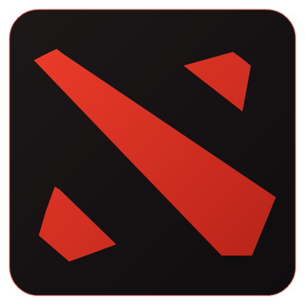

# Mod Assistant para Dota 2

**Gestor de mods para Dota 2 en Windows: catálogo de más de 1.300 mods, cosméticos del propio juego y el Arsenal VIP con todos los inmortales, arcanas y exclusivos.**

[**Descargar instalador**](https://github.com/Dreftian/Dota2-Mods-Releases/releases/latest/download/Dota2-Mod-Setup.exe) ·
[Versión portable](https://github.com/Dreftian/Dota2-Mods-Releases/releases/latest/download/Dota2.Mod.exe) ·
[Sitio web](https://dota2-mods.vercel.app) ·
[Notas de versión](https://github.com/Dreftian/Dota2-Mods-Releases/releases/latest) ·
[English](#english)

---

## Qué es este repositorio

Aquí se publican las **versiones compiladas** de Mod Assistant y el **código fuente de cada una**. La aplicación instalada busca sus actualizaciones en este repositorio, así que cada versión nueva llega sola a quien ya la tiene.

| Archivo de cada versión | Para qué sirve |
|---|---|
| `Dota2-Mod-Setup.exe` | Instalador de un clic, sin permisos de administrador. Se actualiza solo. |
| `Dota2.Mod.exe` | Versión portable: no instala nada; avisa cuando hay una versión nueva. |
| `latest.yml`, `portable.yml`, `*.blockmap` | Los usa el actualizador automático. No hace falta descargarlos. |
| `Mod-Assistant-<versión>-source.zip` | El código fuente exacto de esa versión (licencia GPL-3.0). |

## Qué hace la aplicación

- **Catálogo de más de 1.300 mods de la comunidad**: héroes, efectos, terrenos, árboles, río, creeps, torres, Roshan, guardianes, mensajeros, HUDs, emblemas, iconos, cursores, fuentes, locutores, música, sonidos y packs. Instalar, activar, desactivar y quitar con un clic.
- **Cosméticos del propio juego, gratis**: clima, terreno, HUD, pantallas de carga, mensajeros, guardianes, creeps, torres, música, locutores, rachas de asesinatos, packs de cursores y skins de Roshan, leídos de tu instalación de Dota 2.
- **Arsenal VIP**: cualquier inmortal, arcana o cosmético de cualquier héroe, por espacio, con estilos, variantes y sets completos, y un filtro de **exclusivos que la tienda nunca vendió** (cofres, pases de batalla, eventos).
- **Personalizador de rango y nivel de héroe** para tu perfil.
- **Presets** que se comparten como enlace o archivo, detección de conflictos por contenido, orden de carga y packs combinados.
- **En español, inglés y ruso**, con actualizaciones automáticas.

## Instalación

1. Descarga el [instalador](https://github.com/Dreftian/Dota2-Mods-Releases/releases/latest/download/Dota2-Mod-Setup.exe) y ábrelo.
2. Si Windows SmartScreen avisa, es porque el ejecutable aún no tiene firma de código: pulsa **Más información → Ejecutar de todas formas**.
3. La aplicación encuentra Dota 2 sola. Si no, indícale la carpeta `game` dentro de `dota 2 beta`.

Requisitos: Windows 10 u 11 de 64 bits y Dota 2 instalado desde Steam.

## Seguridad y privacidad

- Cada escritura en la carpeta del juego es una transacción: si algo falla, todo vuelve a como estaba.
- Nada se escribe mientras Dota 2 está abierto, y los archivos originales se guardan antes de reemplazarlos.
- Los mods y cosméticos cambian solo lo que dibuja **tu** cliente; los demás jugadores no ven nada distinto. La aplicación no toca la memoria del juego ni a otros jugadores.
- No se recopila ningún dato.
- Usar mods es decisión tuya: Valve puede cambiar sus reglas en cualquier momento.

## Informar un problema

Abre un [issue](https://github.com/Dreftian/Dota2-Mods-Releases/issues) con la versión (aparece en Configuración), qué hiciste y qué esperabas. Adjunta el informe de diagnóstico (Configuración → Diagnóstico → Exportar informe): no contiene datos personales.

## Licencia y créditos

Mod Assistant es software libre bajo la [GNU GPL v3.0 o posterior](LICENSE) y deriva de un proyecto de código abierto con la misma licencia. Cada versión publicada incluye su código fuente completo. Los mods del catálogo pertenecen a sus autores.

Dota 2 es una marca registrada de Valve Corporation. Este proyecto no está afiliado, respaldado ni patrocinado por Valve.

---

## English

**Mod Assistant** is a Windows mod manager for Dota 2: a catalog of 1,300+ community mods, the game's own cosmetics for free, and **Arsenal VIP**, which puts any immortal, arcana or exclusive on any hero.

This repository holds the **builds** and the **source code of every release**. Installed copies update from here.

- [Download the installer](https://github.com/Dreftian/Dota2-Mods-Releases/releases/latest/download/Dota2-Mod-Setup.exe) or the [portable build](https://github.com/Dreftian/Dota2-Mods-Releases/releases/latest/download/Dota2.Mod.exe). Windows 10/11 x64.
- If SmartScreen warns, the executable is not code-signed yet: **More info → Run anyway**.
- Every write to the game folder is one transaction that rolls back on failure; nothing is written while Dota runs; originals are backed up; nothing is collected. Mods change only what your own client draws. Use them at your own discretion.
- Licensed under the GPL-3.0-or-later; each release ships its complete source archive.
- Dota 2 is a trademark of Valve Corporation. Not affiliated with or endorsed by Valve.
